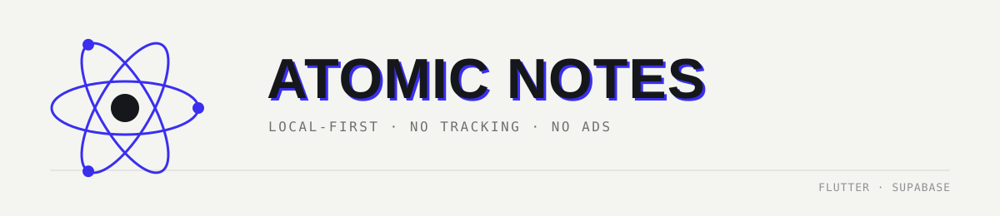
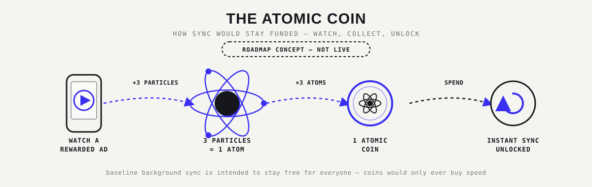

  

  
  [-3A2FF0.svg)](#license)

  Local-first notes. Optional cloud sync. No trackers, no analytics, no ad SDKs today.

## Contents
* [What this is](#what-this-is)
* [Features](#features)
* [Privacy & Security](#privacy--security)
* [Usability](#usability)
* [Design System](#design)
* [Get the App](#get-the-app)
* [Roadmap](#roadmap)
* [License](#license)
* [Author](#author)

---

## What this is
Atomic Notes is a note-taking app built on a simple premise: your notes should work with zero friction, whether you are online or offline, and you should never have to guess what happens to your data. 

*   **Stack:** Built with a Flutter client and a Supabase backend (Postgres, Auth, Row-Level Security, and Realtime).
*   **Storage:** Local-first architecture utilizing Hive CE (`hive_ce`) for on-device storage.
*   **The Promise:** There are no subscriptions, no AI integrations, no analytics SDKs, and no ad SDKs in the app today. 

*Note: The source code is currently not public. This is a deliberate, temporary choice while security-sensitive parts of the app are hardened. Publishing the source is planned; until then, this README is written to be exact about what is and isn't protected.*

---

## Features
*   **Notes and checklists, side by side:** Text notes and to-do checklists are first-class objects of the same type. Both count toward the same 50-note free limit and behave identically.
*   **Instant local save:** Every note writes to on-device storage the moment you stop typing.
*   **Fully usable offline:** Local storage is the primary copy of your notes. The app launches at the same speed whether you are online or offline, and launch never blocks on the network.
*   **Optional cloud sync:** Sign in once and your notes sync to your other devices via Supabase. Sync operates on a per-note realtime basis rather than re-uploading an entire notebook blob.
*   **Biometric app lock:** Fingerprint or face unlock (via `local_auth`) can gate the app, layered securely on top of your account sign-in.
*   **Dedicated Stats Screen:** A plain-numbers "Database" screen displays your note count, sync status, and account info.
*   **Strict free tier:** The 50-note limit is enforced server-side via Postgres, not just hidden client-side.

---

## Privacy & Security
Precision matters more here than sounding impressive. Here is exactly where things stand today:

**What is actually protected right now:**
*   Data in transit is protected by standard HTTPS.
*   Data at rest in the cloud is scoped by Supabase Row-Level Security (RLS) access control, ensuring only your signed-in account can read or write your notes.
*   The app collects zero telemetry. There are no crash-reporters, no third-party trackers, and no analytics.

**What is NOT protected today (Stated Plainly):**
*   **Notes are NOT end-to-end encrypted**. Content is currently base64-encoded for storage. This is an important technical distinction: encoding is easily reversible by anyone with direct access to the data, whereas encryption is not.
*   Local, on-device Hive storage is also unencrypted at rest today. 
*   *Closing this gap with genuine client-side encryption is the top roadmap priority, not a someday-maybe.*

---

## Usability
*   **One sign-in, then it's yours:** An active session is currently required to bypass the splash screen, but it is a one-time step. Your session persists across launches.
*   **A short walkthrough, once:** New users get a brief onboarding tutorial that disappears for good once completed.
*   **Lock screen priority:** If biometric lock is enabled, it takes priority over everything else at launch so it cannot be accidentally bypassed.

---

## Design System
The UI follows a strict, disciplined system called **Technical Editorial**. It relies on condensed uppercase headings, hairline rules instead of shadows, and deliberate restraint on color.

| Token | Hex | Role |
| :--- | :--- | :--- |
| **Ink** | `#15171B` | Typography, borders, inverted blocks. |
| **Paper** | `#F4F5F1` | The background canvas. |
| **Signal** | `#3A2FF0` | Sync, active states, focus—the only accent color. |

**Typography:** Bebas Neue for headings, Hanken Grotesk for body copy, and JetBrains Mono for metadata and status readouts.

---

## Get the App
*   **Android:** Prebuilt Android releases are currently distributed via the [GitHub Releases](../../releases) page. 
*   **Google Play:** There is no Google Play Store listing planned. 
*   **Future Distribution:** An Amazon Appstore listing is planned strictly to satisfy future AdMob eligibility requirements. F-Droid may be explored in the future as a separate ad-free build flavor.

---

## Roadmap
*This roadmap tracks the active development of the project. Tasks will be checked off as they are deployed to production.*

- [x] **Client-Side Encryption:** Upgrade the base64-encoding to genuine client-side cryptography. This ensures notes are fundamentally unreadable to anyone but the account holder, securing data at rest both in local storage and in the Supabase cloud.
- [ ] **Publish Source Code:** Open the repository to public read access (and potentially community contributions) now that the primary security hardening and encryption features are integrated.
- [ ] **Amazon Appstore Listing & Developer Verification:** 
    - **Verification:** Register for Android Developer Verification via the low-friction path to get ahead of Google's expanding enforcement requirements for sideloaded apps.
    - **Listing:** Publish the app on the Amazon Appstore. This is required because Google AdMob mandates that an app be listed in a recognized app store before it is eligible to serve ads.
- [ ] **The Atomic Coin System (CONCEPT — NOT LIVE):**
    

      
    

    Implement the gamified, opt-in ad economy to fund cloud infrastructure without requiring subscriptions:
    
    - **The Mechanic:** Watch 1 rewarded ad to earn 3 particles (1 electron + 1 proton + 1 neutron). 3 particles automatically form 1 Atom. Collect 3 Atoms to mint 1 Atomic Coin.
      
    - **The Utility:** Spend 1 Atomic Coin to unlock 1 instant/on-demand cloud sync.
      
    - **The Guarantee:** Maintain a free, unmetered periodic background sync for all users. Coins only buy speed and convenience, never the fundamental guarantee that a note is saved and synced.
      
    - **Security & Anti-Fraud:** Build a server-authoritative coin ledger in Supabase and integrate AdMob Server-Side Verification (SSV). This ensures rewarded-ad completions are verified by the server rather than trusted from the client, preventing spoofing on rooted or modified devices.
      
- [ ] **Alternative Funding Channels:** Integrate GitHub Sponsors, Ko-fi, or Open Collective. This provides a parallel, no-ads-required option for users who prefer to support the project via direct donations.
- [ ] **Task & Reminder Notifications:** Implement local push notifications for checklists and reminders once the core sync engine and coin economy are thoroughly stable.

---

## License
MIT — See the [`LICENSE`](LICENSE) file. 

## Author
Built by **Ashutosh Sharma** ([DevBehindYou](https://devbehindyou.vercel.app)) — web development, SEO, and applied AI.
*   [Portfolio](https://devbehindyou.vercel.app)
*   [GitHub](https://github.com/DevBehindYou)
*   [Medium](https://medium.com/@devbehindyou)
*   [X (Twitter)](https://x.com/devbehindyou)
